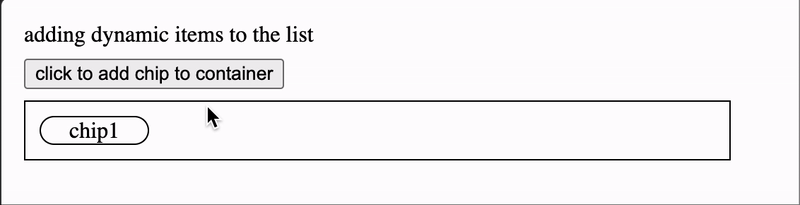
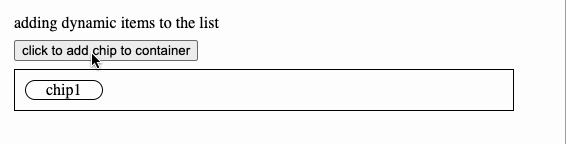

# react-truncated-chips
A headless component to implement a truncated chips based on parent container/screen size for users!
Super powerful UI experience but simple to integrate and easy to use.



Some similar solutions already exists to achieve this sort of UI behaviour, but I couldn't find an actively maintained package
that fit all of my needs. Here are several components that inspired this that you may want to check out as well:
- [react-truncate-markup](https://github.com/patrik-piskay/react-truncate-markup)
- [react-truncate](https://github.com/pablosichert/react-truncate) - text truncation only
- [react-text-truncate](https://github.com/ShinyChang/React-Text-Truncate) - text truncation only

## Features:  
✅ reverse rendering children  
  
✅ works with any react elements that accept a ref as children  
✅ custom overflow indicator  
✅ custom spacing between children components  
✅ responsive to parent container/screen size  
✅ small bundle size 2.1kb (minified + gzipped)

## Install
```bash
  npm install --save react-truncated-chips

  or

  yarn add react-truncated-chips
```

## Documentation
Please see our storybook [here](https://react-truncated-chips.vercel.app)
